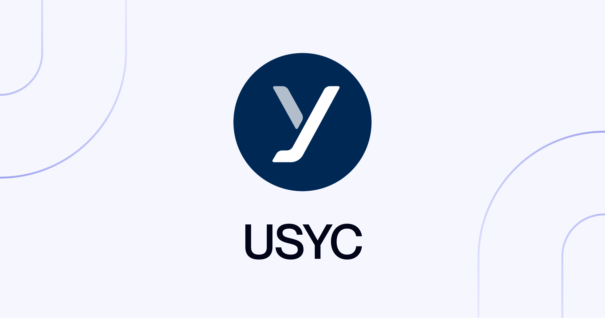

<h1 style="text-align: center">Hashnote's US Yield Coin on Noble</h1>

This repository includes the `x/halo` Cosmos SDK module implementation.

For more information, refer to the module's [spec](../x/halo/spec) files.
